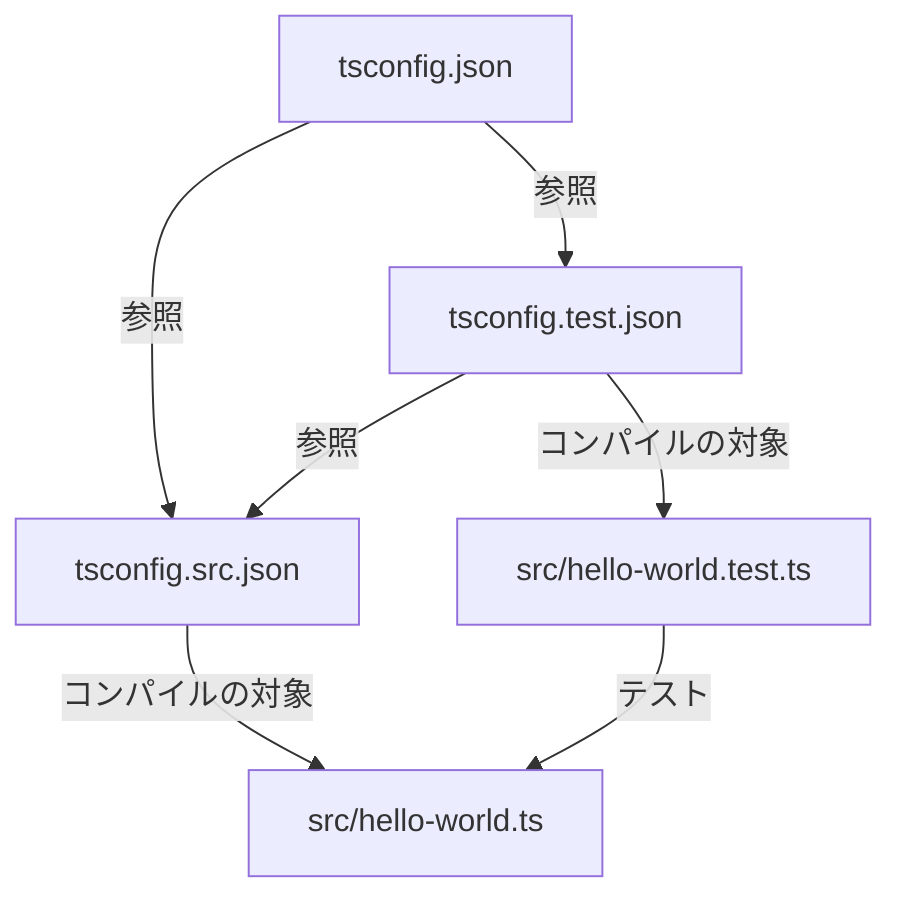

# このサンプルについて


このサンプルプロジェクトは、TypeScriptのプロジェクトリファレンス機能を使用して、ソースコードとテストコードを分離した構造を持つサンプルライブラリです。この構造により、ビルドの最適化と依存関係の明確化を実現しています。

## ディレクトリ構造

```
.
├── package.json
├── src
│   ├── hello-world.test.ts
│   └── hello-world.ts
├── tsconfig.json
├── tsconfig.src.json
└── tsconfig.test.json
```

## 主要ファイルの説明

1. **package.json**
	- プロジェクトの依存関係と設定を定義
	- 主な依存関係: TypeScript, Vitest (テストフレームワーク)

2. **src/hello-world.ts**
	- メインのソースコードファイル
	- `helloWorld` 関数を定義

3. **src/hello-world.test.ts**
	- `hello-world.ts` のテストファイル
	- Vitest を使用してテストを実行

4. **tsconfig.json**
	- ルートの TypeScript 設定ファイル
	- ソースコードとテストコードの設定ファイルへの参照を含む

5. **tsconfig.src.json**
	- ソースコード用の TypeScript 設定
	- テストファイルを除外し、出力ディレクトリを指定

6. **tsconfig.test.json**
	- テストコード用の TypeScript 設定
	- ソースコードの設定を参照し、出力を生成しない設定

## プロジェクト構造の特徴とメリット

### プロジェクトリファレンスによる分離構造とビルドの最適化

このプロジェクト構造の最も重要な特徴は、プロジェクトリファレンスを使用してソースコードとテストコードを別々のTypeScriptプロジェクトとして扱っていることです。この分離構造により、ビルドパフォーマンスの最適化が実現されます。具体的には、ソースコードのみをビルドすることが可能となり、大規模プロジェクトでのビルド時間を大幅に短縮できます。この特徴は、ルートの`tsconfig.json`で両方のプロジェクトを参照し、`tsconfig.src.json`と`tsconfig.test.json`で個別の設定を定義することで実現されています。



### 明確な依存関係の管理

次に、このプロジェクト構造は明確な依存関係の管理を可能にします。テストプロジェクトがソースプロジェクトに依存する構造を採用することで、テストコードがソースコードに依存することを明示的に示すと同時に、誤ってソースコードがテストコードに依存することを防止しています。この依存関係の管理は、`tsconfig.test.json`でソースコードの設定を参照し、`tsconfig.src.json`でテストファイルを除外することで実現されています。

### ビルド出力の制御による誤ったコード混入の防止

最後に、ソースコードとテストコードで異なるビルド設定を使用することで、ビルド出力の制御を行っています。これにより、テストコードが誤って本番環境にリリースされることを防止するという重要なメリットがあります。具体的には、`tsconfig.src.json`で出力ディレクトリを指定し、`tsconfig.test.json`で`noEmit: true`を設定してテストコードの出力を防止しています。

## 使用方法

1. 依存関係のインストール: `yarn install`
2. ソースコードのビルド: `yarn tsc -b tsconfig.src.json`
3. テストの実行: `yarn vitest`
4. 全体のコンパイルチェック: `yarn tsc -b`
