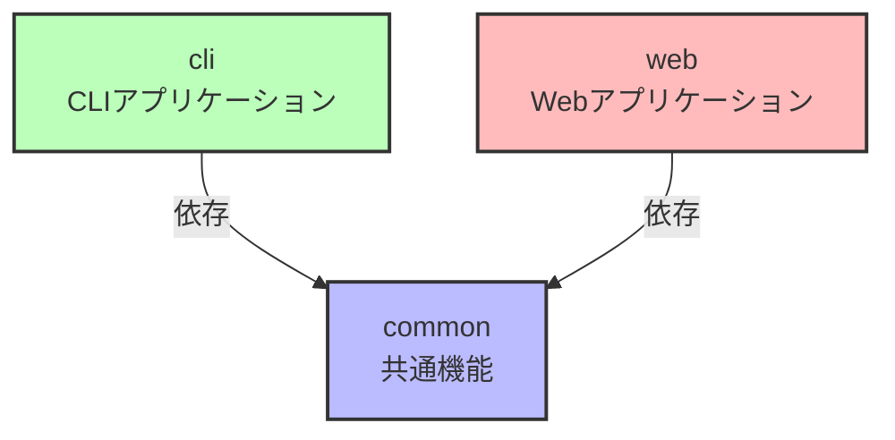

# TypeScriptプロジェクトリファレンスを使用したモノレポ構成

このサンプルコードでは、TypeScriptのプロジェクトリファレンス機能を活用してモノレポ（monorepo）を構築する手順を詳細に説明します。

## モノレポとは

TODO: モノレポを知らない人向けに簡単に説明を書く。

## プロジェクト構造の設計

まず、プロジェクトの全体構造を設計します。典型的なモノレポ構造は以下のようになります：

```
.
├── package.json
├── packages (プログラムコードを置く場所)
│   ├── cli
│   ├── common
│   └── web
├── tsconfig.base.json (全パッケージで共通のコンパイル設定を記述するファイル)
├── tsconfig.json (プロジェクトリファレンスの設定を記述するファイル)
```

`packages` 内の各パッケージは次のような依存関係を持つものとします:



`common`パッケージで共通の機能を実装し、それを`cli`(CLIアプリケーション)と`web`(ウェブアプリケーション)で利用するといたケースをイメージしてください。

## ルートディレクトリの設定

ルートディレクトリに `package.json` ファイルを作成し、以下の内容を記述します：

```json
{
  "name": "your-monorepo-name",
  "private": true,
  "workspaces": [
    "packages/*"
  ]
}
```

次に、TypeScriptをインストールします：

```shell
npm install -D typescript
```

いろいろ書いてありますが、重要なのは`workspaces`の部分です。これはnpmワークスペースの設定です。これがあることで、この`package.json`があるディレクトリがモノレポのルートディレクトリであるという目印になります。加えて、ここで指定したファイルパスにマッチするディレクトリが、パッケージとしてnpmに認識されるようになります。ここでは、`packages/*`となっているので、それにマッチする`packages/cli`, `packages/common`, `packages/web`がパッケージとして認識されます。この設定は、あくまでnpmワークスペース固有の設定であり、TypeScriptのプロジェクトリファレンスの機能ではありませんが、両者はセットで用いると便利なので、ここで取り上げています。

## 共通の設定ファイルの作成

### tsconfig.base.json

ルートディレクトリに `tsconfig.base.json` を作成し、共通のTypeScript設定を記述します：

```json
{
  "compilerOptions": {
    "module": "Preserve",
    "moduleResolution": "Bundler",
    "target": "ESNext",
    "declaration": true,
    "composite": true,
    "strict": true,
    "esModuleInterop": true,
    "rootDir": "${configDir}/src",
    "outDir": "${configDir}/dist"
  }
}
```

このファイルは、各パッケージ(`common`, `cli`, `web`)の共通のコンパイルオプションを記述します。こういったファイルを一つ用意しておくことで、同じコンパイルオプションを各パッケージにコピペして配置していくことを避けることができます。

これらの設定の中で、プロジェクトリファレンスとして必須なのは`composite: true`です。基本的には、プロジェクトリファレンスにおける「プロジェクト」として特定のディレクトリを認識させるには、各パッケージの`tsconfig.json`にこの設定をもたせる必要があります。今回は、このコピペも避けるために、`tsconfig.base.json`に書いておきます。

### tsconfig.json

ルートディレクトリに `tsconfig.json` を作成し、プロジェクトリファレンスを設定します：

```json
{
  "include": [],
  "references": [
    {
      "path": "packages/cli"
    },
    {
      "path": "packages/common"
    },
    {
      "path": "packages/web"
    }
  ]
}
```

このファイルは、このモノレポに何のパッケージがあるかをTypeScriptコンパイラーに知らせる目次のような役割を果たします。TypeScriptファイルをコンパイルすることはこのファイルの役目ではないため、`include`を空っぽにしてあります。

## パッケージの作成

`packages` ディレクトリ内に各サブパッケージ（cli、common、web）のディレクトリを作成し、それぞれに必要なファイルを追加します。

### 共通パッケージ (common)

#### packages/common/package.json

```json
{
  "name": "@company/common",
  "type": "module",
  "exports": "./dist/index.js"
}
```

`common`パッケージはライブラリとして共通機能を提供したいので、`exports`を指定します。これにより、`cli`と`web`パッケージから、`common`パッケージを`import`して共通機能を利用できるようになります。

#### packages/common/tsconfig.json

```json
{
  "extends": "../../tsconfig.base.json"
}
```

`common`パッケージのコンパイル設定は、上の手順で作ったモノレポルートの`tsconfig.base.json`を継承する形で設定します。

#### packages/common/src/index.ts

ここには、`common`パッケージが提供する共通機能を実装します。今回は、`"Hello World"`を返す関数を提供することにしましょう。

```typescript
export function helloWorld(): string {
  return "Hello World";
}
```

### CLI パッケージ (cli)

#### packages/cli/package.json

`cli`パッケージは`common`パッケージを使いたいので、`dependecies`に`common`パッケージへの依存を追加しておきましょう。

```json
{
  "name": "@company/cli",
  "type": "module",
  "dependencies": {
    "@company/common": "*"
  }
}
```

#### packages/cli/tsconfig.json

`cli`パッケージは`common`パッケージに依存しているため、それをTypeScriptコンパイラーに理解させるために、`references`に`common`パッケージの参照を追加しておきます。

```json
{
	"extends": "../../tsconfig.base.json",
	"references": [
		{
			"path": "../common"
		}
	]
}
```

#### packages/cli/src/index.ts

`common`パッケージの`helloWorld`関数をインポートし、呼び出す処理を書きます。

```typescript
import { helloWorld } from "@company/common";

console.log(helloWorld());
```

### Web パッケージ (web)

`web`パッケージは`cli`パッケージと同様です。

#### packages/web/package.json

```json
{
  "name": "@company/web",
  "type": "module",
  "dependencies": {
    "@company/common": "*"
  }
}
```

#### packages/web/tsconfig.json

```json
{
	"extends": "../../tsconfig.base.json",
	"references": [
		{
			"path": "../common"
		}
	]
}
```

#### packages/web/src/index.ts

```typescript
import { helloWorld } from "@company/common";

console.log(helloWorld());
```

## インストール

依存関係をインストールします：

```shell
npm install
```

## ビルド

モノレポ全体をビルドしてみましょう。

```shell
npx tsc -b
```

これを実行すると、各パッケージに`dist`ディレクトリが作られ、コンパイルされたJavaScriptが生成されます。

## 実行

```shell
node ./packages/cli/dist/index.js
```

出力結果として「Hello World」が出れば成功です！

## まとめ

このガイドでは、TypeScriptのプロジェクトリファレンス機能を使用してモノレポを構築する方法を詳細に説明しました。この構造により、大規模なTypeScriptプロジェクトを効率的に管理し、ビルド時間を短縮することができます。必要に応じて、さらにパッケージを追加したり、ビルド設定をカスタマイズしたりすることで、プロジェクトの要件に合わせて拡張できます。
